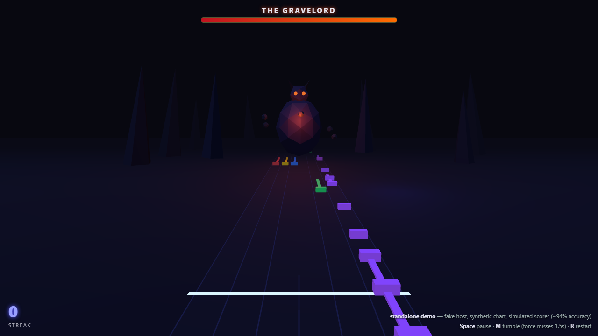

# feedBack plugin: Boss Fight

A [feedBack](https://github.com/got-feedBack/feedBack) **visualization plugin** that replaces
the highway with a 3D boss-fight arena rendered in Three.js (WebGL2). The note highway runs
through the foreground and the boss looms in the background.



## Gameplay

- **Streaks attack, and the spells grow with you.** Every 5 consecutive correct notes casts
  at the boss, and damage scales with the length of your streak. Up to 14 streak you lob
  **fireballs** with ember trails. From 15 you call **lightning strikes** down from the sky.
  From 25 you launch **curses**, slow corkscrewing orbs that poison the boss with damage
  ticking over time. Drop the boss to zero HP and it dies. The next archetype then spawns a
  level higher with 30% more HP.
- **Three boss archetypes** cycle as levels climb, each with its own silhouette, palette and
  beat-synced attack:
  - **The Gravelord**: one huge ember-trailed boulder. Launches on the downbeat, lands 4
    beats later.
  - **Storm Wraith**: a volley of three crackling ball-lightning orbs launched on consecutive
    beats, each in flight for 3 beats (overlapping riff windows).
  - **Pyre Fiend**: two flaming meteors dropped from overhead, fast 2-beat flights back to
    back.
- Every projectile launches on a beat and lands on a beat. Play the riff under its flight
  cleanly (no misses, at least half the notes hit) and it gets **deflected** back into the
  boss for heavy counter-damage. Flub it and you get **crushed**: screen flash, camera shake,
  streak gone.
- **Enrage:** below 35% HP the boss's eyes burn brighter and it attacks every 4 measures
  instead of every 8.
- A miss anywhere breaks your streak and makes the boss's eyes flare.
- The strike line pulses on every beat.

## Install

Clone into your feedBack plugins directory (Desktop: Settings -> Plugins shows the path,
web/Docker: `plugins/` next to the app), then restart:

```bash
cd /path/to/feedback/plugins
git clone https://github.com/carelesshangman/feedback-plugin-bossfight bossfight
```

Then in the player, pick **Boss Fight** from the visualization picker.

### Hit detection

Verdicts come from whatever scorer plugin has registered a note-state provider
(e.g. `note_detect` with the mic on). With no scorer active, the **Auto-hit (demo mode)**
per-instance setting (default on) treats every note as a hit so the fight is watchable
without an instrument. The moment a real scorer produces a verdict, auto-hit disengages
automatically. An `AUTO-HIT` badge in the top right corner shows while auto-hit is driving
the judging.

Per-instance settings (viz settings panel): **Auto-hit** and **Screen shake**.

## Standalone demo (no feedBack needed)

A fake host with a synthetic 120 BPM chart and a simulated scorer at roughly 94% accuracy:

```bash
npm run demo        # serves on http://localhost:8137
# open http://localhost:8137/demo/demo.html
```

Keys: **Space** pause, **M** fumble (forces misses for 1.5 s, get crushed by the next
boulder), **R** restart.

URL params: `?hp=20` (weaker bosses, quick level cycling), `?speed=4` (chart time runs 4x,
handy for watching all archetypes fast) and `?nomiss=1` (perfect play, so the streak climbs
through every spell tier).

## How it works

- `plugin.json` declares `"type": "visualization"`, so the plugin appears in the
  main-player / splitscreen viz pickers.
- `screen.js` exports the setRenderer factory `window.feedBackViz_bossfight` with
  `contextType: 'webgl2'`. The host swaps the canvas to a fresh one so Three.js can own it.
- Each `draw(bundle)` frame it reads `bundle.currentTime`, `notes`, `chords`, `beats`,
  `stringCount`, `lefty`/`inverted`, and judges due notes via
  `bundle.getNoteState(note, chartTime)`.
- Boss attacks are scheduled off `beats[].measure` boundaries, so projectiles launch and land
  on downbeats. Projectile flight advances in **chart time**, so it pauses with playback and
  stays beat-consistent.
- HUD (boss HP, streak, toasts, crush flash) is a DOM overlay with cached element refs.
  No per-frame DOM queries, per the plugin performance rules.
- Three.js is vendored at `assets/three.module.js` (`npm run vendor` refreshes it) and loaded
  with a dynamic `import()` resolved relative to the script URL, falling back to the sandboxed
  `/api/plugins/bossfight/assets/` route.
